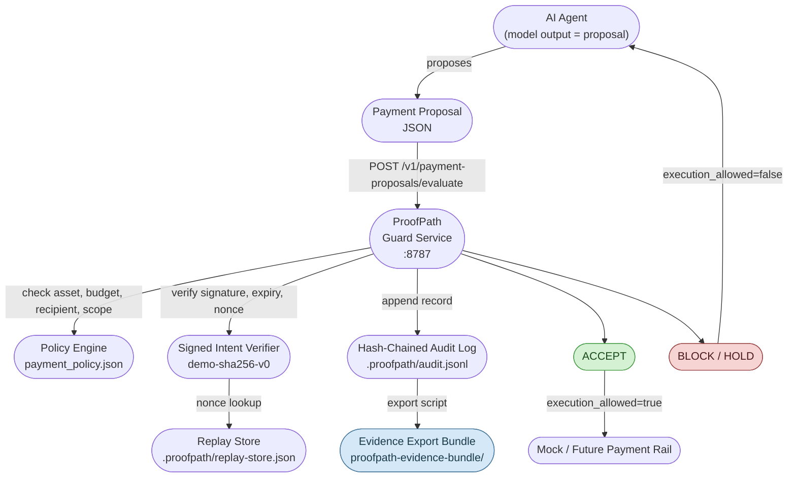

# ProofPath

```markdown
## NGI TALER reviewer path

ProofPath Agent Payment Guard was submitted to NGI TALER as an open-source auxiliary layer for privacy-preserving AI-agent payment authorization.

Start here:

- [`docs/NGI_TALER_REVIEWER_PATH.md`](docs/NGI_TALER_REVIEWER_PATH.md)
- [`docs/TALER_ALIGNMENT.md`](docs/TALER_ALIGNMENT.md)
- [`docs/AGENT_PAYMENT_GUARD_DEMO.md`](docs/AGENT_PAYMENT_GUARD_DEMO.md)
- [`docs/BUDGET_AND_MILESTONES.md`](docs/BUDGET_AND_MILESTONES.md)

Reviewer quick commands:

```bash
bash examples/agent-payment-guard/run_demo_check.sh
bash examples/agent-payment-guard/run_service_check.sh
bash examples/agent-payment-guard/run_e2e_evidence_demo.sh
bash examples/agent-payment-guard/run_mock_rail_demo.sh
```

Grant metadata:

```text
Application: 2026-08-00b
Fund: NGI TALER
Requested amount: EUR 50,000
Correct repository: https://github.com/safal207/ProofPath
```
```


**Verifiable intent for every critical action.**

> **HTTPS protects the connection. ProofPath protects the meaning of the action.**
>
> HTTPS secures the channel. ProofPath secures the intent.

ProofPath is an open protocol and gateway layer for adding verifiable intent, causal authorization, and auditable action chains to HTTPS APIs and AI-agent systems.

HTTPS proves that a connection is secure. ProofPath proves that an action was authorized, causally grounded, and accountable.

> HTTPS proves the channel. ProofPath proves the action.

## Agent Payment Guard

> **Model output is a proposal, not authorization.**

ProofPath is an external authorization and evidence layer for AI-agent payments.

It verifies signed human intent before execution and exports tamper-evident evidence for every ACCEPT, HOLD, or BLOCK decision.

```text
AI agents will need payment rails.
Payment rails need authorization.
Authorization needs evidence.
ProofPath provides that evidence.
```

**What it does:**

- Requires a signed intent envelope before any payment is executed
- Enforces policy: asset allow-list, budget cap, recipient scope, recurring approval
- Persists spent nonces — a replayed envelope is always `BLOCK / INTENT_REPLAYED`
- Writes every decision to a hash-chained `audit.jsonl` that survives service restart
- Exports a portable evidence bundle verifiable offline without the live service

**What it does not do:** no real wallet, no token transfer, no custody, no private keys, no SDK, no RPC, no JWS, no EIP-712.

External packaging:

- [Agent Payment Guard brief](docs/agent-payment-guard-brief.md)
- [90-second demo script](docs/agent-payment-guard-90-second-demo.md)

### Architecture



Full architecture diagrams: [`docs/architecture.md`](docs/architecture.md)

API contract: [`openapi/proofpath-guard-service-v0.1.yaml`](openapi/proofpath-guard-service-v0.1.yaml)  
OpenAPI notes: [`docs/openapi.md`](docs/openapi.md)

### Quickstart

```bash
# install: stdlib only, no dependencies

# run all checks
bash examples/agent-payment-guard/run_demo_check.sh
bash examples/agent-payment-guard/run_service_check.sh
bash examples/agent-payment-guard/run_evidence_export_check.sh

# full end-to-end story: ACCEPT -> replay BLOCK -> export -> verify
bash examples/agent-payment-guard/run_e2e_evidence_demo.sh

# mock payment rail: prove ACCEPT reaches the rail; BLOCK/HOLD never execute
bash examples/agent-payment-guard/run_mock_rail_demo.sh
```

Expected output:

```text
[e2e] step 1 — valid signed intent: ACCEPT
  decision: ACCEPT
  execution_allowed: true

[e2e] step 2 — replay same envelope: BLOCK / INTENT_REPLAYED
  decision: BLOCK
  reason: INTENT_REPLAYED
  execution_allowed: false

[e2e] step 3 — export evidence bundle
  hash chain: chain valid (2 records)
  bundle ready: proofpath-evidence-bundle/

[e2e] step 4 — verify bundled audit log
  audit log: OK (2 records, chain valid)

[e2e] ✓ ProofPath Agent Payment Guard demo complete.
```

See [`docs/demo-transcript-payment-guard.md`](docs/demo-transcript-payment-guard.md) for full expected output.

---

## 60-second reviewer summary

**ProofPath is a defensive pre-execution gateway that prevents valid AI-agent/API credentials from becoming unsafe, unaudited, or irreversible actions.**

ProofPath does **not** replace HTTPS, OAuth, IAM, API keys, or ordinary infrastructure security. Those layers remain necessary. ProofPath adds an action-level security and audit layer at the execution boundary: before a high-risk AI-agent or API action reaches the protected upstream system.

If you arrived here from an already-submitted grant application under an earlier name or framing, start with the [Submitted Application Reviewer Bridge](docs/SUBMITTED_APPLICATION_REVIEWER_BRIDGE.md). To understand how the related repositories fit together, see the [Ecosystem Graph](docs/ECOSYSTEM_GRAPH.md).

### Three product surfaces

| Surface | Path | What it gives you |
| --- | --- | --- |
| Agent Payment Guard | [`examples/agent-payment-guard/`](examples/agent-payment-guard/) | Authorization and evidence layer for AI-agent payments. Signed intent, policy, replay protection, hash-chained audit, portable evidence bundle. |
| CI evidence gate | [`action.yml`](action.yml), [`docs/GITHUB_ACTION_QUICKSTART.md`](docs/GITHUB_ACTION_QUICKSTART.md) | Turn ProofPath audit logs into CI-verifiable metrics and pass/fail checks. |
| Personal Agent Guard | [`examples/personal-agent-guard/`](examples/personal-agent-guard/) | Add a local approval boundary and audit log around Claude Code / Codex-style AI coding tools. |

Product phrase:

```text
ProofPath turns action-boundary audit logs into CI-verifiable evidence.
```

Personal workflow phrase:

```text
ProofPath Personal Agent Guard is a local seatbelt for AI coding tools.
```

### Why HTTPS is not enough

HTTPS can protect the connection. API authentication can prove that a credential is valid. IAM can define broad permissions.

But high-risk AI-agent systems need an additional question:

> Should this specific action be allowed to execute now?

A request can be authenticated and still be unsafe. For example, an AI agent may have valid credentials while attempting to delete data, modify infrastructure, push unsafe code, trigger a financial workflow, or perform an irreversible administrative action outside the intended scope.

ProofPath focuses on that gap.

### What ProofPath does

ProofPath evaluates high-risk actions before execution and can produce explicit decisions such as `ACCEPT`, `HOLD`, `REJECT`, `BLOCK`, or `AUDIT`.

The current prototype demonstrates:

- declared intent checks;
- causal parent checks;
- scope checks;
- reversibility classification;
- human approval requirements for irreversible actions;
- a Rust verifier crate;
- an Axum gateway;
- upstream forwarding only after a ProofPath decision;
- blocking unsafe irreversible actions before they reach the protected API;
- hash-chained JSONL audit logs;
- dangerous-action and real-model-agent demos;
- reusable GitHub Action evidence gate;
- local Personal Agent Guard for Claude Code / Codex-style tools;
- Agent Payment Guard with signed intent, replay protection, and portable evidence export.

### ACCEPT vs BLOCK

Conceptually:

```text
ACCEPT:
  action has declared intent
  action has causal parent
  action is within scope
  action is reversible or approved
  gateway forwards upstream

BLOCK:
  action is irreversible
  action lacks required human approval
  gateway blocks before upstream execution
  decision is written to the audit log
```

### Why Compute Witness matters

Compute Witness turns AI/agent compute into reviewable evidence: a job manifest declares intent, scope, causal authorization, and commitments before a result is trusted.

The repository includes Python conformance, audit packet examples, challenge fixtures, a Rust verifier adapter, a Rust CLI, expected output fixtures, Rust audit-hash verification, and CI regression checks.

Reviewers can run the path locally without trusting a hidden service: start with the [Compute Witness grant reviewer path](docs/COMPUTE_WITNESS_GRANT_REVIEWER_PATH.md), the [Submitted Application Reviewer Bridge](docs/SUBMITTED_APPLICATION_REVIEWER_BRIDGE.md), the [Ecosystem Graph](docs/ECOSYSTEM_GRAPH.md), or the [Compute Witness reviewer quickstart](examples/compute-witness/README.md#reviewer-quickstart).

### Reviewer links

- [Start Here: ProofPath v0.1](docs/START_HERE_V0_1.md)
- [ProofPath v0.1 reviewer checklist](docs/REVIEWER_CHECKLIST_V0_1.md)
- [Clean-checkout reviewer runbook](docs/reviewer-runbook.md)
- [Audit log verification](docs/audit-log-verification.md)
- [ProofPath v0.1 landing](docs/LANDING_V0_1.md)
- [Personal Agent Guard](examples/personal-agent-guard/)
- [Agent Payment Guard](examples/agent-payment-guard/)
- [Agent Payment Guard brief](docs/agent-payment-guard-brief.md)
- [Agent Payment Guard 90-second demo](docs/agent-payment-guard-90-second-demo.md)
- [Architecture diagrams](docs/architecture.md)
- [Agent Payment Guard demo transcript](docs/demo-transcript-payment-guard.md)
- [Agent Payment Guard service docs](docs/agent-payment-guard-service.md)
- [ProofPath Guard Service OpenAPI](openapi/proofpath-guard-service-v0.1.yaml)
- [OpenAPI notes](docs/openapi.md)
- [Reviewer summary](docs/reviewer-summary.md)
- [ProofPath v0.1 Product Milestone](docs/RELEASE_V0_1.md)
- [Evidence Packet v0.1](docs/EVIDENCE_PACKET_V0_1.md)
- [Evidence Metrics v0.1](docs/EVIDENCE_METRICS_V0_1.md)
- [ProofPath GitHub Action quickstart](docs/GITHUB_ACTION_QUICKSTART.md)
- [Submitted Application Reviewer Bridge](docs/SUBMITTED_APPLICATION_REVIEWER_BRIDGE.md)
- [Ecosystem Graph](docs/ECOSYSTEM_GRAPH.md)
- [Compute Witness grant reviewer path](docs/COMPUTE_WITNESS_GRANT_REVIEWER_PATH.md)
- [TRC / TPU evidence plan](docs/TRC_TPU_EVIDENCE_PLAN.md)
- [Compute Witness reviewer quickstart](examples/compute-witness/README.md#reviewer-quickstart)
- [Internet Action Layer](docs/internet-action-layer.md)
- [Conformance fixtures](conformance/README.md)
- [Security grant revision note](docs/grant-updates/security-grant-revision-proofpath-update.md)
- [Threat model](specs/threat-model.md)
- [Model guardrail bypass threat note](docs/threats/model_guardrail_bypass.md)
- [HTTP action-context profile](specs/proofpath-http-profile-v0.1.md)
- [Mock payment rail demo](examples/agent-payment-guard/run_mock_rail_demo.sh)
- [Community experiments](COMMUNITY_EXPERIMENTS.md)

## Quick demo

Run the one-minute AI agent dangerous action demo:

```bash
python3 examples/upstream/demo_server.py
cargo run -p proofpath-gateway
bash examples/agent-dangerous-action/agent_delete_without_approval.sh
```

Expected result:

```text
BLOCK IRREVERSIBLE_REQUIRES_HUMAN_APPROVAL
```

Then verify the audit log:

```bash
python3 scripts/verify_audit_log.py proofpath-audit.jsonl
```

## v0.1 value proposition

ProofPath v0.1 gives AI safety, infra, and platform teams a local, reproducible way to answer:

```text
Did this agent action have enough declared intent and causal authorization to execute?
```

The answer is enforced before the action reaches the protected service and written to a tamper-evident audit log that CI can verify.

## Included runnable examples

| Demo | Command | What it shows |
| --- | --- | --- |
| Dangerous irreversible action | `bash examples/agent-dangerous-action/agent_delete_without_approval.sh` | Blocks an irreversible delete request before it reaches the upstream API. |
| Safe reversible action | `bash examples/agent-dangerous-action/agent_get_status.sh` | Allows a safe status read request. |
| Real model agent | `python3 examples/real-model-agent/real_model_agent_demo.py --mode safe` / `--mode unsafe` | Shows that even a model-generated request must pass the action boundary. |
| CI evidence gate | `python3 scripts/check_audit_metrics.py proofpath-audit.jsonl --max-block-rate 0.5` | Turns audit logs into CI pass/fail evidence. |
| Personal Agent Guard | `bash examples/personal-agent-guard/run_demo_check.sh` | Local seatbelt for Claude Code / Codex-style tools. |
| Agent Payment Guard | `bash examples/agent-payment-guard/run_e2e_evidence_demo.sh` | Signed intent, replay protection, hash-chained audit, and portable evidence bundle. |
| Mock Payment Rail | `bash examples/agent-payment-guard/run_mock_rail_demo.sh` | Proves ACCEPT reaches mock rail; BLOCK/HOLD never execute. |

## What changed in v0.1

Earlier ProofPath discussions were mostly protocol- or gateway-oriented. This v0.1 repository now demonstrates a compact product path:

```text
agent/API action
  -> ProofPath gateway
  -> explicit ACCEPT/BLOCK decision
  -> audit log
  -> CI-verifiable evidence metrics
```

That makes ProofPath easier to review, fund, and deploy incrementally.

## Product milestone v0.1

ProofPath v0.1 is a small but complete developer-facing evidence loop:

```text
agent/API action
  -> pre-execution guard
  -> ACCEPT/BLOCK decision
  -> hash-chained audit log
  -> metrics summary
  -> CI pass/fail gate
```

See [ProofPath v0.1 Product Milestone](docs/RELEASE_V0_1.md) for the full runbook and acceptance checks.

## Evidence metrics v0.1

ProofPath can turn a hash-chained audit log into CI-verifiable metrics:

```bash
python3 scripts/check_audit_metrics.py proofpath-audit.jsonl --max-block-rate 0.5
```

Example output:

```json
{
  "total": 2,
  "accepted": 1,
  "blocked": 1,
  "accept_rate": 0.5,
  "block_rate": 0.5,
  "decisions": {
    "ACCEPT": 1,
    "BLOCK": 1
  }
}
```

This provides a simple release gate:

```text
if block_rate > allowed_threshold:
    fail CI
```

See [Evidence Metrics v0.1](docs/EVIDENCE_METRICS_V0_1.md) for details.

## GitHub Action quickstart

ProofPath can be used as a reusable CI gate:

```yaml
name: ProofPath Audit Gate

on: [pull_request]

jobs:
  proofpath-audit:
    runs-on: ubuntu-latest
    steps:
      - uses: actions/checkout@v4
      - uses: ./
        with:
          audit_log: proofpath-audit.jsonl
          max_block_rate: "0.5"
```

See [GitHub Action quickstart](docs/GITHUB_ACTION_QUICKSTART.md) for a copy-paste workflow.

## Components

```text
ProofPath protocol
ProofPath gateway
Policy engine
Protected API
Append-only audit log
```

See [`docs/architecture.md`](docs/architecture.md) for full Mermaid system diagrams.

## Planned components

```text
ProofPath CLI
ProofPath SDK
ProofPath Policy Packs
ProofPath Dashboard
```

## Status

ProofPath v0.1 is an experimental safety and audit prototype.

It is intended for local demos, grant review, early integration experiments, and safety-oriented design review.

It is not production-ready security infrastructure yet.

## License

MIT
