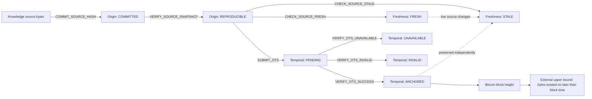
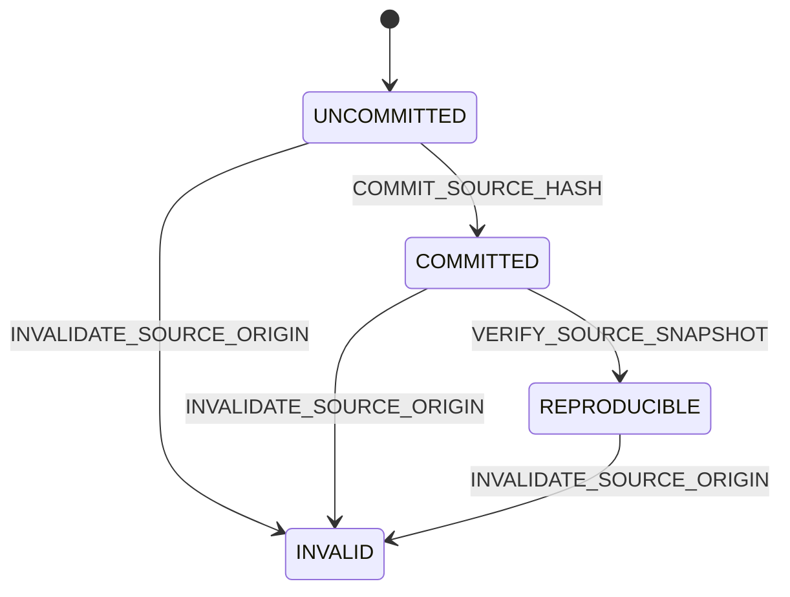
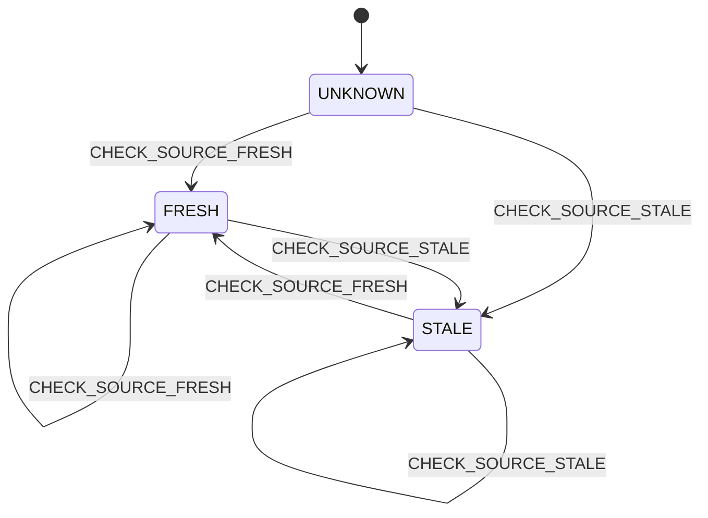
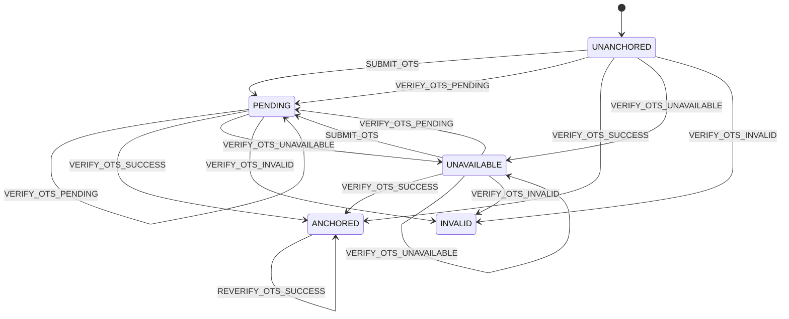

# Causal-temporal transition graph

Status: **experimental stacked profile**  
Depends on: `proofpath.temporal-anchor.ots.v0.1`

## Purpose

A provenance hash, a live-source check, and a Bitcoin temporal anchor answer
different questions. Combining them into one scalar status loses causality and
can produce false regressions. This profile represents one immutable subject as
a product state:

```text
S(t) = (origin(t), freshness(t), temporal(t))
```

- `origin` answers whether the historical bytes are committed and reproducible;
- `freshness` answers whether a current source still matches those bytes;
- `temporal` answers whether the exact bytes have an independently verified time upper bound.

A source can therefore be both `STALE` and `ANCHORED`: the live page changed,
but the historical bytes remain reproducible and were proven to exist before a
Bitcoin block. Those facts must not overwrite each other.

## Full causal chain



## Independent state axes

### Origin axis



### Freshness axis



Freshness can change as the live source changes. It does not rewrite the frozen
snapshot or remove an existing temporal anchor.

### Temporal axis



There is intentionally no `ANCHORED → PENDING`, `ANCHORED → UNAVAILABLE`, or
`ANCHORED → INVALID` transition for the same exact subject bytes. A later failed
verification attempt is a new observation; it cannot erase a previously
verified historical fact. A contradiction must be recorded separately and
investigated rather than silently rolling back the state.

## Event record

Each transition is an append-only causal event:

```json
{
  "seq": 4,
  "parent_event_id": "sha256:...",
  "event_type": "VERIFY_OTS_SUCCESS",
  "state_before": {
    "origin": "REPRODUCIBLE",
    "freshness": "FRESH",
    "temporal": "PENDING"
  },
  "state_after": {
    "origin": "REPRODUCIBLE",
    "freshness": "FRESH",
    "temporal": "ANCHORED"
  },
  "subject_hash": "sha256:...",
  "evidence_ref": "evidence:ots-verification",
  "observed_at": "2026-07-22T05:00:00Z",
  "temporal_bound": {
    "kind": "not_later_than",
    "bitcoin_block_height": 900001,
    "attested_before": "2026-07-22T04:55:00Z"
  },
  "event_id": "sha256:..."
}
```

`event_id` is SHA-256 over compact, sorted-key UTF-8 JSON of every event member
except `event_id` itself. `parent_event_id` creates the causal chain.

## Time semantics

The graph intentionally carries two different time concepts:

- `observed_at` orders local observations inside one trace. It is operational metadata and remains dependent on the observer clock.
- `temporal_bound.attested_before` is an externally verified upper bound derived from an OTS proof and Bitcoin block. It does not claim the exact creation time.

`issued_at` is not used to prove temporal precedence. A self-declared timestamp
may be useful metadata, but it cannot replace the external bound.

## Mechanical invariants

The checker rejects a trace when any of these invariants fails:

1. `seq` starts at zero and has no gaps or duplicates;
2. every `parent_event_id` equals the previous recomputed `event_id`;
3. every event recomputes to its declared `event_id`;
4. `subject_hash` never changes inside one trace;
5. `observed_at` never moves backward inside one trace;
6. `state_before` equals the prior event's `state_after`;
7. the event type is declared in the graph;
8. only the transition's declared axis may change;
9. the axis transition must be explicitly allowed;
10. required transition evidence must be present;
11. a successful temporal anchor must carry block height and external upper bound.

## Deviation signals

| Deviation | Checker signal |
| --- | --- |
| Missing or duplicate sequence | `SEQUENCE_GAP_OR_DUPLICATE` |
| Broken causal parent | `PARENT_EVENT_MISMATCH` |
| Event bytes modified | `EVENT_ID_MISMATCH` |
| Different subject inserted into trace | `SUBJECT_HASH_DRIFT` |
| Observer time moved backward | `OBSERVED_AT_REGRESSION` |
| State does not continue from prior event | `STATE_BEFORE_MISMATCH` |
| Unknown event type | `UNDECLARED_TRANSITION` |
| Forbidden state move | `ILLEGAL_AXIS_TRANSITION` |
| A transition changes another axis | `UNDECLARED_AXIS_MUTATION` |
| Evidence omitted | `MISSING_TRANSITION_EVIDENCE` |
| Anchor omits block/time bound | `MISSING_REQUIRED_TRANSITION_FIELD` |

## Supersession boundary

Re-extracting changed source bytes creates a new `subject_hash` and therefore a
new trace. It must not mutate the prior trace. A separate record may connect the
new trace with `supersedes_trace_ref`, but each trace remains independently
recomputable.

This rule distinguishes:

```text
same subject + new observation  → append event to existing trace
new subject bytes               → create new trace and link by supersession
```

## Scope boundary

This profile proves transition consistency for recorded events. It does not
prove that every real-world event was recorded. Completeness requires an
independent boundary or seal that commits to the expected event count or time
window. The graph catches mutation, gaps inside the held chain, illegal moves,
and semantic drift; it cannot detect an entirely omitted unsealed suffix by
itself.
