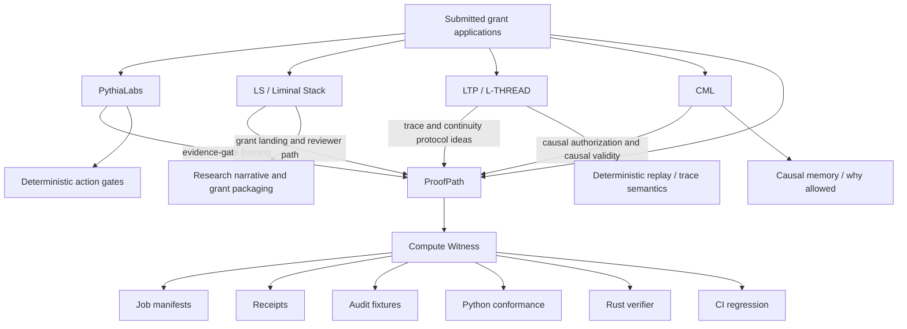

# Ecosystem Graph

This page maps the connected repositories and project surfaces around ProofPath.

The purpose is not to collapse all projects into one name. The purpose is to help reviewers understand the shared research program and navigate from any submitted application surface into the current executable evidence.

## Core idea

Each repository is a different surface of the same research program:

```text
make high-risk AI-agent actions inspectable,
causally grounded,
and reviewable before trust.
```

A grant application, email inquiry, or repository link should act like a cable into the ecosystem:

```text
application surface
  -> relevant repository
  -> current executable evidence
  -> related protocol or research layer
  -> known limitations and next milestones
```

## High-level graph



## Repository roles

| Surface | Primary role | How it connects |
| --- | --- | --- |
| ProofPath | Current executable implementation hub | Action-boundary gateway, verifier crate, Compute Witness evidence path. |
| Compute Witness | Reviewable compute evidence workstream inside ProofPath | Turns AI/agent compute into manifests, receipts, audit logs, conformance checks, and Rust verifier primitives. |
| PythiaLabs | Evidence-gate project surface | Earlier and parallel framing for deterministic gates over high-risk AI-agent actions. Links to ProofPath continuation evidence. |
| LS / Liminal Stack | Grant and reviewer packaging surface | Connects broader safety narrative, cognitive garden materials, and reviewer-facing grant paths to implementation artifacts. |
| LTP / L-THREAD | Protocol and trace-continuity surface | Captures trace, replay, continuity, inspection, and conformance ideas that inform ProofPath and Compute Witness. |
| CML | Causal memory and causal-validity surface | Captures the "why allowed" layer: permissions, causal parentage, and responsibility for state changes. |
| T-Trace / related trace work | Integrity and trace-verification surface | Supports the idea that traces should be canonical, tamper-evident, and reproducible. |
| CaPU / related gating work | Decision-gate architecture surface | Frames Gate -> Commit -> Execute style pipelines and decision codes. |

## Reviewer routing

### If you came from a PythiaLabs application

Start with:

- PythiaLabs continuation note: `docs/PROOFPATH_CONTINUATION_FOR_REVIEWERS.md` in the PythiaLabs repository.
- ProofPath submitted application bridge: `docs/SUBMITTED_APPLICATION_REVIEWER_BRIDGE.md`.
- Compute Witness grant reviewer path: `docs/COMPUTE_WITNESS_GRANT_REVIEWER_PATH.md`.

Mapping:

```text
PythiaLabs evidence gates
  -> ProofPath action-boundary verifier
  -> Compute Witness evidence chain
```

### If you came from an LS / Liminal Stack application

Start with:

- ProofPath submitted application bridge.
- Compute Witness grant reviewer path.
- Reviewer quickstart in `examples/compute-witness/README.md`.

Mapping:

```text
Liminal Stack deterministic oversight narrative
  -> ProofPath implementation surface
  -> Compute Witness executable evidence
```

### If you came from LTP / L-THREAD

Start with:

- ProofPath action-context profile.
- Compute Witness manifests and receipts.
- Conformance fixtures and CI checks.

Mapping:

```text
trace continuity and replay semantics
  -> action-context validation
  -> committed evidence fixtures
```

### If you came from CML

Start with:

- Compute Witness causal parent checks.
- Audit packet examples.
- Rust verifier work.

Mapping:

```text
causal memory / why allowed
  -> causal authorization
  -> receipt and audit evidence
```

## Current executable evidence

The strongest current implementation evidence is in ProofPath / Compute Witness:

- root reviewer summary;
- submitted application reviewer bridge;
- Compute Witness grant reviewer path;
- reviewer quickstart;
- committed job manifests, receipts, and audit fixtures;
- Python conformance validator;
- audit packet examples;
- broken-evidence challenge fixtures;
- Rust verifier adapter;
- Rust CLI path;
- expected Rust output fixture;
- Rust audit-hash verification primitive;
- CI regression checks.

Quick commands:

```bash
python3 scripts/validate_compute_witness.py
cargo run -q -p proofpath-verifier --bin proofpath-compute-witness -- examples/compute-witness/job_manifest.accept.json
```

## Why this graph matters

The ecosystem is intentionally layered:

```text
PythiaLabs asks: should this AI-agent action proceed under current evidence?
CML asks: why was this action allowed, and what causal permission supports it?
LTP asks: can the trace and decision path be inspected and replayed?
ProofPath asks: should this authenticated request become an executed action?
Compute Witness asks: can this AI/agent compute result be trusted as reviewable evidence?
```

Together, they form a research program around verifiable intent, causal authorization, deterministic inspection, and reviewable evidence.

## What this does not claim

This graph does not claim that all repositories are identical, complete, or production-ready.

It also does not claim current support for:

- GPU hardware identity;
- trusted execution environment attestation;
- zkML correctness;
- model truthfulness;
- production key management;
- certified regulatory compliance;
- distributed settlement;
- full replay/dispute resolution across all repositories.

Those are possible future layers. The current strongest claim is narrower:

```text
The ecosystem already contains executable, inspectable, and regression-tested evidence artifacts for reviewing high-risk AI-agent actions before trust.
```

## Funding interpretation

Funding would not start from a blank concept. It would connect and harden existing surfaces:

```text
current: linked repos + executable fixtures + verifier primitives + reviewer paths
next: deeper Rust verification + richer challenge suites + pilot integrations + clearer cross-repo conformance
```

## One-sentence reviewer phrase

```text
Each repository is a different surface of the same research program: making high-risk AI-agent actions inspectable, causally grounded, and reviewable before trust.
```
