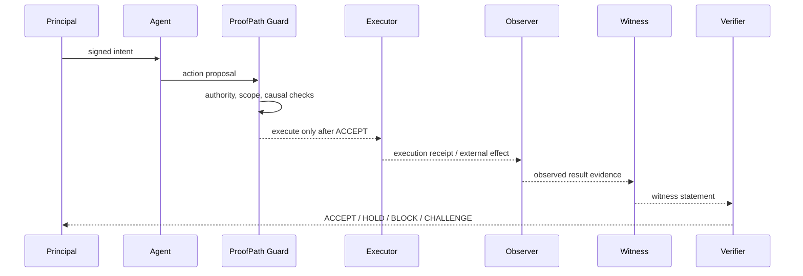

# Proof of Causal Integrity (PoCI) v0.1

Status: Draft normative specification  
Profile identifier: `proofpath.poci.v0.1`  
Envelope schema: `schemas/action-proof-envelope.v0.1.schema.json`

## 1. Purpose

Proof of Causal Integrity (PoCI) defines a portable evidence contract for deciding whether a high-risk AI-agent action is supported by verifiable intent, authority, causal grounding, execution evidence, observed-result evidence, and witness evaluation.

PoCI v0.1 is a single-node reference profile. It does not define distributed consensus, token economics, hardware attestation, zkML correctness, production key custody, or regulatory certification.

## 2. Core invariants

1. Model output is a proposal, never authorization.
2. Missing required evidence MUST NOT produce `ACCEPT`.
3. Authorization and causal grounding MUST be evaluated separately.
4. A claimed execution MUST NOT be treated as an observed result.
5. Security-relevant evidence MUST be content-addressed.
6. A verifier MUST fail closed on unsupported profiles, malformed evidence, or ambiguous security fields.
7. Irreversible actions MUST require explicit approval evidence.
8. Verification output MUST include stable reason codes.

## 3. Actors

- **Principal** — human or organization whose intent authorizes the action.
- **Agent** — system proposing an action.
- **Executor** — component that attempts or performs the action.
- **Observer** — component recording the externally observed result.
- **Witness** — independent evaluator producing a signed or content-addressed statement.
- **Challenger** — actor presenting contradictory or tampering evidence.
- **Verifier** — implementation that validates the envelope and emits a decision.

One implementation MAY perform multiple roles, but role reuse MUST be declared in evidence.

## 4. Evidence lifecycle



## 5. Envelope sections

An Action Proof Envelope MUST contain:

- `protocol`
- `intent`
- `authority`
- `causal_context`
- `proposal`
- `execution`
- `observed_result`
- `witnesses`
- `verification`
- `evidence_integrity`

The schema is structural. A conforming verifier MUST additionally evaluate semantic relationships between sections.

## 6. Decision semantics

### 6.1 `ACCEPT`

A verifier MAY emit `ACCEPT` only when all mandatory evidence is present, structurally valid, internally consistent, within validity windows, causally grounded, in scope, integrity-checked, and free of unresolved witness conflict.

### 6.2 `HOLD`

A verifier MUST emit `HOLD` when the action is not currently safe to accept but the missing condition is plausibly resolvable without proving malicious evidence. Examples include a missing causal parent reference that policy permits a human reviewer to supply.

### 6.3 `BLOCK`

A verifier MUST emit `BLOCK` when a policy or authorization invariant is violated, the profile is unsupported, replay is detected, an irreversible action lacks required approval, or evidence is malformed in a security-relevant way.

### 6.4 `CHALLENGE`

A verifier MUST emit `CHALLENGE` when apparently valid evidence conflicts with other evidence, a committed artifact does not match its digest, witnesses equivocate, or execution/result substitution is detected.

`CHALLENGE` indicates a dispute-worthy integrity failure. It does not prove which actor is malicious.

## 7. Decision precedence

When multiple findings exist, the verifier MUST use this precedence:

```text
CHALLENGE > BLOCK > HOLD > ACCEPT
```

A higher-precedence decision MUST NOT suppress secondary reason codes.

## 8. Stable reason-code registry

### Protocol and structure

- `POCI_PROFILE_UNSUPPORTED`
- `POCI_SCHEMA_INVALID`
- `POCI_REQUIRED_EVIDENCE_MISSING`
- `POCI_EXTENSION_NOT_ALLOWED`

### Intent and authority

- `INTENT_SIGNATURE_UNVERIFIED`
- `INTENT_EXPIRED`
- `INTENT_REPLAYED`
- `AUTHORITY_MISSING`
- `AUTHORITY_SCOPE_VIOLATION`
- `AUTHORITY_BUDGET_EXCEEDED`
- `IRREVERSIBLE_APPROVAL_MISSING`

### Causality

- `CAUSAL_PARENT_MISSING`
- `CAUSAL_PARENT_MISMATCH`
- `CAUSAL_CHAIN_UNVERIFIED`

### Execution and result

- `PROPOSAL_EXECUTION_MISMATCH`
- `EXECUTION_RECEIPT_MISSING`
- `EXECUTION_RECEIPT_DIGEST_MISMATCH`
- `OBSERVED_RESULT_MISSING`
- `RESULT_DIGEST_MISMATCH`

### Witness and integrity

- `WITNESS_QUORUM_UNMET`
- `WITNESS_CONFLICT`
- `WITNESS_EQUIVOCATION`
- `ENVELOPE_ROOT_MISMATCH`
- `ARTIFACT_DIGEST_MISMATCH`
- `VERIFIER_INTERNAL_FAIL_CLOSED`

Reason codes are append-only within the v0.1 profile. Their meaning MUST NOT be silently changed.

## 9. Minimum semantic checks

A conforming verifier MUST:

1. Validate the JSON Schema.
2. Confirm `profile_id == "proofpath.poci.v0.1"`.
3. Check intent validity interval and replay identifier.
4. Bind authority to principal, agent, action kind, scope, and optional budget.
5. Confirm causal parent presence and relationship according to policy.
6. Bind proposal digest to execution receipt.
7. Bind execution receipt to observed result where an external result is claimed.
8. Verify every declared digest using the canonicalization profile.
9. Evaluate witness uniqueness, statements, and conflicts.
10. Recompute the envelope root.
11. Emit deterministic normalized output.

## 10. Compatibility with ProofPath decisions

| Existing ProofPath concept | PoCI v0.1 |
| --- | --- |
| `ACCEPT` | `ACCEPT` |
| `HOLD` | `HOLD` |
| `BLOCK` / `REJECT` | `BLOCK` |
| evidence contradiction | `CHALLENGE` |
| reason / finding code | stable `reason_codes[]` |
| hash-chained audit | referenced by `evidence_integrity.artifacts[]` |

Existing ProofPath gateways MAY continue emitting their current decision objects. A PoCI adapter MUST normalize them into this four-decision profile without losing original evidence.

## 11. Walkthroughs

### 11.1 Valid bounded action

A principal authorizes one inference purchase with a bounded scope and budget. The proposal references the signed intent and causal parent. The executor receipt binds the proposal digest. The observer records the result digest. A witness verifies all artifacts. The envelope root matches.

Decision: `ACCEPT`.

### 11.2 Missing authority

The proposal is well-formed but contains no usable authority grant.

Decision: `BLOCK`  
Primary reason: `AUTHORITY_MISSING`.

### 11.3 Missing causal parent

Authorization exists, but the required causal parent is absent and policy allows human remediation.

Decision: `HOLD`  
Primary reason: `CAUSAL_PARENT_MISSING`.

### 11.4 Tampered result

The observed result bytes do not match the committed result digest.

Decision: `CHALLENGE`  
Primary reason: `RESULT_DIGEST_MISMATCH`.

## 12. Versioning

- `schema_version` versions the JSON structure.
- `profile_id` versions the semantic verification profile.
- Verifiers MUST reject unsupported major versions.
- Extensions MUST be placed under `extensions` and MUST NOT override normative fields.
- A verifier MUST ignore unknown non-critical extensions only when policy explicitly permits them.

## 13. Explicit limitations

PoCI v0.1 does not prove:

- that a model output is truthful;
- that GPU or TEE hardware is genuine;
- that an external world observation is objectively true;
- that witnesses are independent;
- that a distributed network reached consensus;
- that financial or legal compliance is certified.

It proves a narrower claim: the declared action-evidence chain is structurally valid, causally connected, integrity-checked, and evaluated under a deterministic profile before trust.
