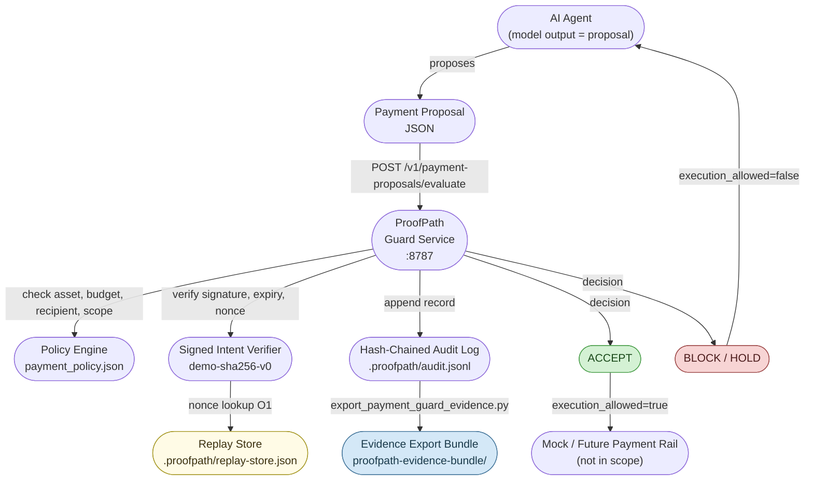
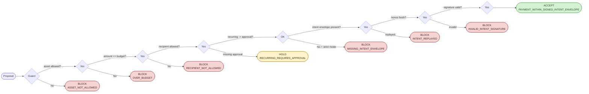
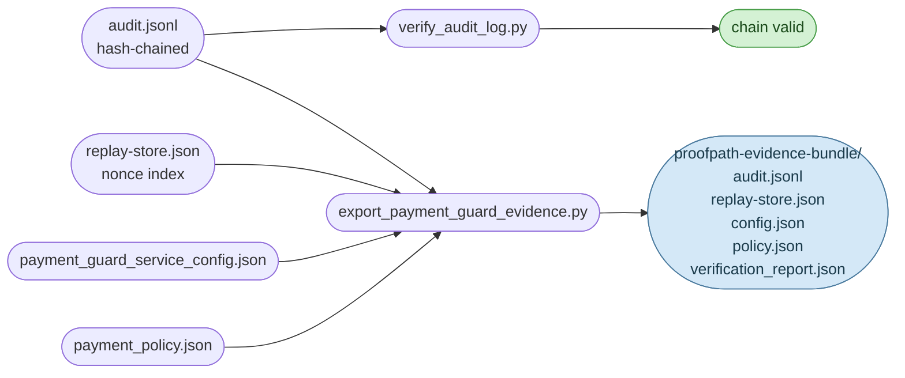

# ProofPath Architecture

## Agent Payment Guard — System Diagram

```mermaid
flowchart TD
    A(["AI Agent\n(model output = proposal)"])
    B(["Payment Proposal\nJSON"])
    C(["ProofPath\nGuard Service\n:8787"])
    D(["Policy Engine\npayment_policy.json"])
    E(["Signed Intent Verifier\ndemo-sha256-v0"])
    F(["Replay Store\n.proofpath/replay-store.json"])
    G(["Hash-Chained Audit Log\n.proofpath/audit.jsonl"])
    H(["Evidence Export Bundle\nproofpath-evidence-bundle/"])
    I(["Mock / Future Payment Rail\n(not in scope)"])
    J(["ACCEPT"])
    K(["BLOCK / HOLD"])

    A -->|proposes| B
    B -->|POST /v1/payment-proposals/evaluate| C
    C -->|check asset, budget, recipient, scope| D
    C -->|verify signature, expiry, nonce| E
    E -->|nonce lookup O1| F
    C -->|append record| G
    G -->|export_payment_guard_evidence.py| H
    C -->|decision| J
    C -->|decision| K
    J -->|execution_allowed=true| I
    K -->|execution_allowed=false| A

    style J fill:#d4f1d4,stroke:#4a9e4a,color:#1a4a1a
    style K fill:#f7d4d4,stroke:#9e4a4a,color:#4a1a1a
    style H fill:#d4e8f7,stroke:#4a7a9e,color:#1a3a4a
    style F fill:#fffbe6,stroke:#a89a2a,color:#3a3010
```

## Decision flow

```mermaid
flowchart LR
    P([Proposal]) --> G{Guard}
    G -->|asset allowed?| A1{Yes}
    G -->|No| BLOCK1([BLOCK\nASSET_NOT_ALLOWED])
    A1 -->|amount <= budget?| A2{Yes}
    A1 -->|No| BLOCK2([BLOCK\nOVER_BUDGET])
    A2 -->|recipient allowed?| A3{Yes}
    A2 -->|No| BLOCK3([BLOCK\nRECIPIENT_NOT_ALLOWED])
    A3 -->|recurring -> approval?| A4{OK}
    A3 -->|missing approval| HOLD([HOLD\nRECURRING_REQUIRES_APPROVAL])
    A4 -->|intent envelope present?| A5{Yes}
    A4 -->|No + strict mode| BLOCK4([BLOCK\nMISSING_INTENT_ENVELOPE])
    A5 -->|nonce fresh?| A6{Yes}
    A5 -->|replayed| BLOCK5([BLOCK\nINTENT_REPLAYED])
    A6 -->|signature valid?| A7{Yes}
    A6 -->|invalid| BLOCK6([BLOCK\nINVALID_INTENT_SIGNATURE])
    A7 --> ACCEPT([ACCEPT\nPAYMENT_WITHIN_SIGNED_INTENT_ENVELOPE])

    style ACCEPT fill:#d4f1d4,stroke:#4a9e4a,color:#1a4a1a
    style BLOCK1 fill:#f7d4d4,stroke:#9e4a4a,color:#4a1a1a
    style BLOCK2 fill:#f7d4d4,stroke:#9e4a4a,color:#4a1a1a
    style BLOCK3 fill:#f7d4d4,stroke:#9e4a4a,color:#4a1a1a
    style BLOCK4 fill:#f7d4d4,stroke:#9e4a4a,color:#4a1a1a
    style BLOCK5 fill:#f7d4d4,stroke:#9e4a4a,color:#4a1a1a
    style BLOCK6 fill:#f7d4d4,stroke:#9e4a4a,color:#4a1a1a
    style HOLD fill:#fff3cc,stroke:#b8860b,color:#3a2a00
```

## Evidence layer

```mermaid
flowchart LR
    A([audit.jsonl\nhash-chained]) --> V([verify_audit_log.py])
    R([replay-store.json\nnonce index]) --> E
    A --> E([export_payment_guard_evidence.py])
    C([payment_guard_service_config.json]) --> E
    P([payment_policy.json]) --> E
    E --> B(["proofpath-evidence-bundle/\naudit.jsonl\nreplay-store.json\nconfig.json\npolicy.json\nverification_report.json"])
    V --> OK([chain valid])

    style B fill:#d4e8f7,stroke:#4a7a9e,color:#1a3a4a
    style OK fill:#d4f1d4,stroke:#4a9e4a,color:#1a4a1a
```
